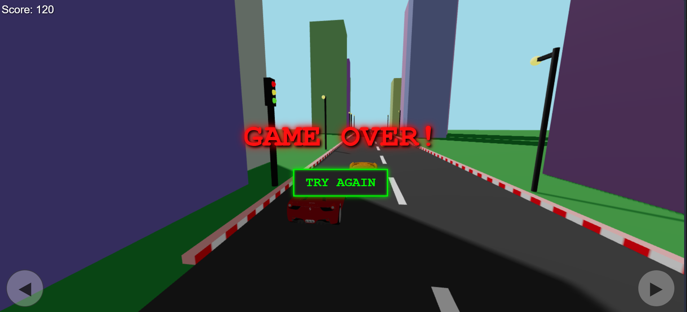

# 🏎️ 3D Car Racing Game

> 🚦 A fast-paced 3D Car Racing Game built using modern web technologies.  
> Dodge obstacles, survive longer, and beat your high score! 🔥

---

<div align="center">

## 🎮 Live Gameplay Preview


⭐ Try to beat your high score!

</div>

### 💀 Game Over Screen


> ⚠️ Make sure to create an `assets` folder and add your screenshots inside it.

---

## ✨ Features

🚗 Smooth 3D Car Controls  
🌆 Minimal 3D City Environment  
🚦 Traffic Lights & Road Elements  
💯 Real-Time Score Counter  
🔁 Try Again Button  
🎮 Keyboard Controls  
⚡ Optimized & Lightweight  

---

## 🛠️ Tech Stack

- 🌐 HTML5  
- 🎨 CSS3  
- 🧊 Three.js (3D Rendering Engine)

---

## 🎯 Controls

| Key | Action |
|------|--------|
| ⬅️ Left Arrow | Move Left |
| ➡️ Right Arrow | Move Right |
| 🔄 R | Restart Game |

---


---

## 🚀 How to Run Locally

```bash
# Clone the repository
git clone https://github.com/Invisiblehqck/3D-Car-Racing-Game.git

# Go inside the folder
cd 3D-Car-Racing-Game

# Open 3D car racing game.html in browser

🌟 Future Enhancements

🏎️ Multiple Car Selection
🌙 Night Mode
🌧️ Rain / Weather Effects
🎵 Background Music
🏆 Online Leaderboard
📱 Mobile Optimization

🤝 Contributing

Contributions are welcome! 🎉

If you'd like to contribute:

🍴 Fork the repository

🌿 Create a new branch (feature-name)

💻 Commit your changes

🚀 Open a Pull Request

Let’s build something amazing together!

👨‍💻 Author

Invisiblehqck

⭐ Show Some Love

If you like this project:

⭐ Star this repo
🍴 Fork it
📢 Share it

🔥 Built With Passion & Code

---
